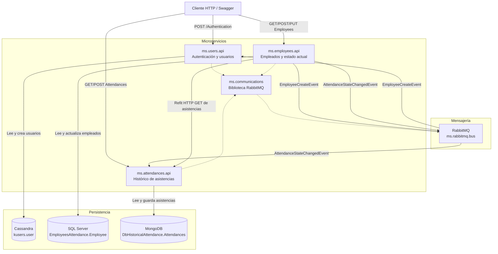
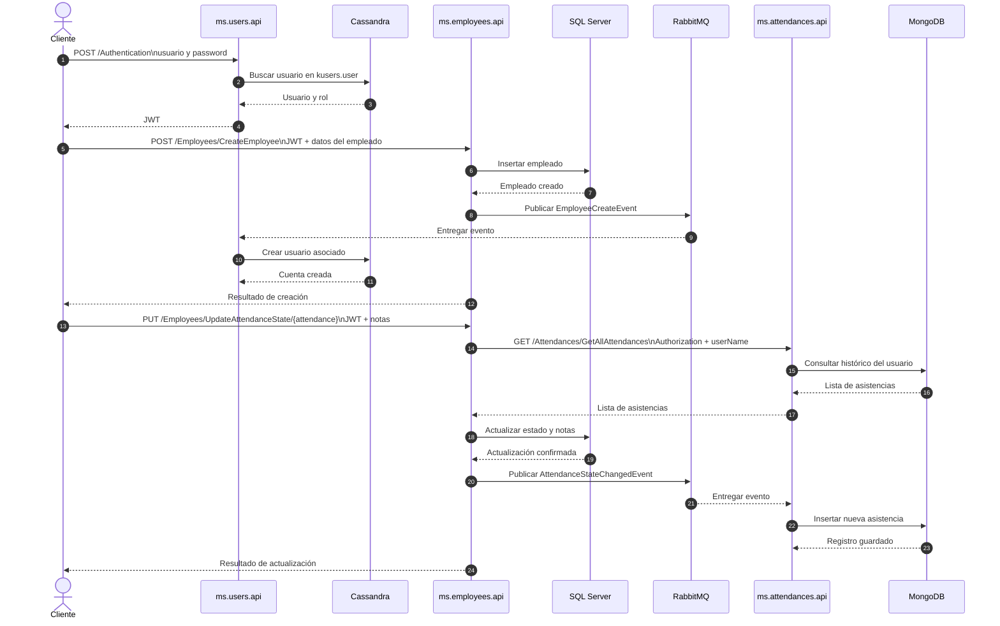

# EmployeeAttendanceControl

Sistema distribuido para gestionar empleados, usuarios y registros históricos de asistencia.

## Arquitectura general

El proyecto está organizado como una solución de microservicios .NET 6. Cada servicio tiene sus propias responsabilidades y almacenamiento, mientras que RabbitMQ permite propagar eventos entre ellos.

### Componentes

- **ms.users**: autenticación, usuarios y emisión de tokens JWT. Usa Cassandra.
- **ms.employees**: gestión de empleados y estado actual de asistencia. Usa SQL Server.
- **ms.attendances**: histórico de asistencias. Usa MongoDB.
- **ms.communications**: biblioteca compartida para publicar y consumir eventos RabbitMQ.
- **RabbitMQ**: bus de mensajes para comunicación asíncrona.
- **SQL Server, Cassandra y MongoDB**: almacenamientos especializados por servicio.

Cada API se divide internamente en capas `api`, `application`, `domain` e `infraestructure` cuando necesita persistencia. Las APIs exponen HTTP y Swagger, y usan JWT para autenticación y autorización.

### Diagrama de componentes



### Comunicación entre servicios

La comunicación síncrona se realiza mediante HTTP. `ms.employees` consulta `ms.attendances` con Refit antes de actualizar el estado de un empleado.

La comunicación asíncrona usa RabbitMQ y colas durables:

| Evento                        | Publica        | Consume          | Propósito                                        |
| ----------------------------- | -------------- | ---------------- | ------------------------------------------------ |
| `EmployeeCreateEvent`         | `ms.employees` | `ms.users`       | Crear la cuenta de usuario asociada al empleado. |
| `AttendanceStateChangedEvent` | `ms.employees` | `ms.attendances` | Guardar el cambio de asistencia en el histórico. |

Los servicios se conectan a RabbitMQ mediante el nombre DNS `ms.rabbitmq.bus` dentro de Docker. El archivo `docker-compose.override.yml` sobrescribe la configuración de `appsettings.json` mediante variables de entorno.

### Diagrama de secuencia

El siguiente flujo resume autenticación, creación de empleados y actualización de asistencia:



### Flujo de arranque

1. Docker Compose crea la red interna y los servicios de infraestructura.
2. RabbitMQ y Cassandra ejecutan sus healthchecks.
3. Las APIs esperan a que las dependencias necesarias estén disponibles.
4. SQL Server ejecuta `initsqldatabase.sql` de forma idempotente.
5. Cassandra ejecuta `cassandra/init.cql` de forma idempotente.
6. Las APIs registran sus consumidores RabbitMQ y comienzan a atender peticiones.

## Docker Compose

El proyecto separa la configuración común de la configuración local:

- `docker-compose.yml`: configuración base. Define las imágenes y los `Dockerfile` de los servicios.
- `docker-compose.override.yml`: configuración de desarrollo. Define puertos locales, variables de entorno, volúmenes de datos y dependencias.

Cuando se ejecuta `docker compose` sin indicar archivos, Compose carga automáticamente `docker-compose.yml` y `docker-compose.override.yml` y combina sus configuraciones.

### Desarrollo

Usa ambos archivos mediante el comportamiento automático de Compose:

```powershell
docker compose up --build
```

Para ejecutarlo en segundo plano:

```powershell
docker compose up -d --build
```

Para detener y eliminar los contenedores y la red:

```powershell
docker compose down
```

SQL Server usa el volumen Docker `sqlserver_data` para almacenar los archivos `.mdf` y `.ldf`. El entrypoint corrige automáticamente los permisos del volumen para el usuario `mssql`, por lo que no es necesario ejecutar `chown` manualmente.

```powershell
docker compose up -d --build
```

El volumen conserva los datos aunque se eliminen los contenedores. El directorio `data/sqlServer` anterior no se elimina; se mantiene como respaldo y ya no se monta en SQL Server.

MongoDB también usa el volumen Docker `mongodb_data`. El directorio `data/mongo` anterior se conserva como respaldo y ya no se monta, porque el almacenamiento WiredTiger del bind mount provocaba reinicios de MongoDB y respuestas HTTP 500 en `attendances.api`.

### Inicialización automática de SQL Server

El servicio `ms.sql.employees.db` usa una imagen personalizada basada en SQL Server. Al iniciar, espera a que SQL Server acepte conexiones y ejecuta `initsqldatabase.sql` automáticamente.

El script crea de forma idempotente:

- la base de datos `EmployeesAttendance`;
- la tabla `dbo.Employee`;
- el registro inicial del usuario `hacero`.

Por tanto, se puede iniciar el entorno normalmente:

```powershell
docker compose up -d --build
```

En reinicios posteriores no se duplican la tabla ni el registro inicial. Los cambios realizados después del arranque se conservan en el volumen `sqlserver_data`.

No ejecutes `docker-compose.override.yml` de forma aislada. Es un archivo parcial y no contiene `image` ni `build` para todos los servicios.

También se pueden indicar los archivos explícitamente:

```powershell
docker compose -f docker-compose.yml -f docker-compose.override.yml up --build
```

### Producción

No uses `docker-compose.override.yml` en producción, porque contiene configuración específica del entorno local, como puertos de desarrollo, volúmenes locales y credenciales de ejemplo.

La ejecución base es:

```powershell
docker compose -f docker-compose.yml up -d
```

Sin embargo, antes de desplegar en producción se recomienda crear un archivo adicional, por ejemplo `docker-compose.prod.yml`, para definir:

- variables de entorno y secretos de producción;
- puertos o un proxy inverso;
- políticas de reinicio;
- volúmenes persistentes adecuados;
- etiquetas, límites de recursos y configuración de red;
- imágenes versionadas, en lugar de etiquetas ambiguas como `latest`.

Con ese archivo, la ejecución sería:

```powershell
docker compose -f docker-compose.yml -f docker-compose.prod.yml up -d
```

Para detener la configuración de producción:

```powershell
docker compose -f docker-compose.yml -f docker-compose.prod.yml down
```

Los secretos reales no deben guardarse en los archivos Compose ni en el repositorio. Deben proporcionarse mediante variables de entorno, un archivo gestionado fuera del control de versiones o un gestor de secretos.
