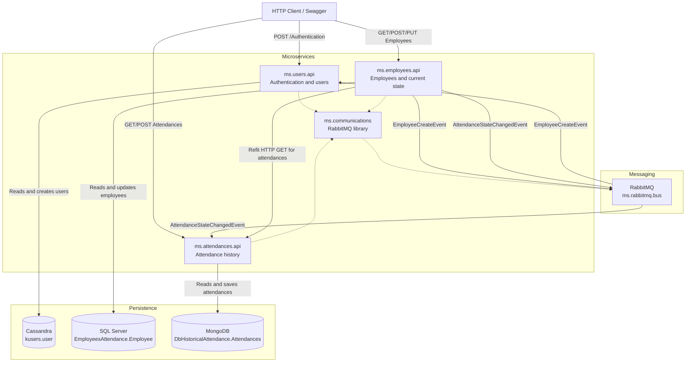
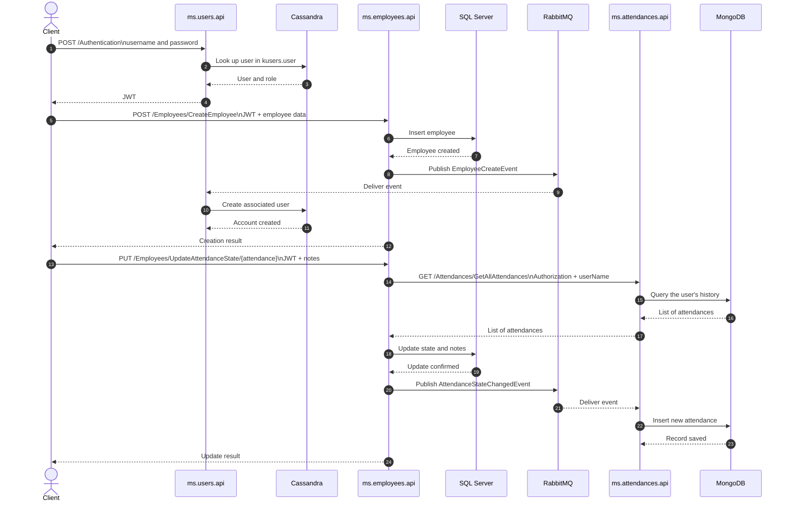

# EmployeeAttendanceControl

Distributed system for managing employees, users, and historical attendance records.

## General architecture

The project is organized as a .NET 10 microservices solution. Each service has its own responsibilities and storage, while RabbitMQ propagates events between them.

### Components

- **ms.users**: authentication, users, and JWT token issuance. Uses Cassandra.
- **ms.employees**: employee management and current attendance state. Uses SQL Server.
- **ms.attendances**: attendance history. Uses MongoDB.
- **ms.communications**: shared library for publishing and consuming RabbitMQ events.
- **RabbitMQ**: message bus for asynchronous communication.
- **SQL Server, Cassandra, and MongoDB**: storage specialized per service.

Each API is internally split into `api`, `application`, `domain`, and `infraestructure` layers when it needs persistence. The APIs expose HTTP and Swagger, and use JWT for authentication and authorization.

### ms.attendances endpoints

| Method | Route | Auth | Description |
|--------|-------|------|-------------|
| GET | `/Attendances?userName={userName}` | any authenticated user | Full attendance history of an employee (used by `ms.employees` via Refit). |
| GET | `/Attendances/ByDateRange?userName={userName}&from={yyyy-MM-dd}&to={yyyy-MM-dd}` | `admin` | Attendances of an employee between two dates, both days inclusive, at most 31 days, most recent first. Returns `[]` when there are none. Invalid input → `400`. |
| POST | `/Attendances` | any authenticated user | Creates an attendance record for the current user. |

### Central package management

The solution uses NuGet Central Package Management (`Directory.Packages.props` at the repository root) to pin a single version per package across all projects. Each `.csproj` references packages without a version, and the actual version is resolved from this central file.

### Component diagram


```mermaid
flowchart TB
	Client[HTTP Client / Swagger]

	subgraph Services[Microservices]
		Users[ms.users.api\nAuthentication and users]
		Employees[ms.employees.api\nEmployees and current state]
		Attendances[ms.attendances.api\nAttendance history]
		Communications[ms.communications\nRabbitMQ library]
	end

	subgraph Messaging[Messaging]
		Rabbit[RabbitMQ\nms.rabbitmq.bus]
	end

	subgraph Data[Persistence]
		Cassandra[(Cassandra\nkusers.user)]
		Sql[(SQL Server\nEmployeesAttendance.Employee)]
		Mongo[(MongoDB\nDbHistoricalAttendance.Attendances)]
	end

	Client -->|POST /Authentication| Users
	Client -->|GET/POST/PUT Employees| Employees
	Client -->|GET/POST Attendances| Attendances

	Users -->|Reads and creates users| Cassandra
	Employees -->|Reads and updates employees| Sql
	Attendances -->|Reads and saves attendances| Mongo

	Users -.-> Communications
	Employees -.-> Communications
	Attendances -.-> Communications
	Communications -.-> Rabbit

	Employees -->|EmployeeCreateEvent| Rabbit
	Rabbit -->|EmployeeCreateEvent| Users
	Employees -->|AttendanceStateChangedEvent| Rabbit
	Rabbit -->|AttendanceStateChangedEvent| Attendances
	Employees -->|Refit HTTP GET for attendances| Attendances
```

### Communication between services

Synchronous communication is done over HTTP. `ms.employees` queries `ms.attendances` with Refit before updating an employee's state.

Asynchronous communication uses RabbitMQ and durable queues:

| Event                          | Publishes       | Consumes          | Purpose                                            |
| ------------------------------- | -------------- | ---------------- | --------------------------------------------------- |
| `EmployeeCreateEvent`          | `ms.employees` | `ms.users`        | Create the user account associated with the employee. |
| `AttendanceStateChangedEvent`  | `ms.employees` | `ms.attendances`  | Save the attendance change in the history.           |

Services connect to RabbitMQ through the DNS name `ms.rabbitmq.bus` inside Docker. The `docker-compose.override.yml` file overrides `appsettings.json` configuration via environment variables.

### Sequence diagram

The following flow summarizes authentication, employee creation, and attendance update:


```mermaid
sequenceDiagram
	autonumber
	actor Client as Client
	participant Users as ms.users.api
	participant Cassandra as Cassandra
	participant Employees as ms.employees.api
	participant SQL as SQL Server
	participant Rabbit as RabbitMQ
	participant Attendances as ms.attendances.api
	participant Mongo as MongoDB

	Client->>Users: POST /Authentication\nusername and password
	Users->>Cassandra: Look up user in kusers.user
	Cassandra-->>Users: User and role
	Users-->>Client: JWT

	Client->>Employees: POST /Employees/CreateEmployee\nJWT + employee data
	Employees->>SQL: Insert employee
	SQL-->>Employees: Employee created
	Employees->>Rabbit: Publish EmployeeCreateEvent
	Rabbit-->>Users: Deliver event
	Users->>Cassandra: Create associated user
	Cassandra-->>Users: Account created
	Employees-->>Client: Creation result

	Client->>Employees: PUT /Employees/UpdateAttendanceState/{attendance}\nJWT + notes
	Employees->>Attendances: GET /Attendances/GetAllAttendances\nAuthorization + userName
	Attendances->>Mongo: Query the user's history
	Mongo-->>Attendances: List of attendances
	Attendances-->>Employees: List of attendances
	Employees->>SQL: Update state and notes
	SQL-->>Employees: Update confirmed
	Employees->>Rabbit: Publish AttendanceStateChangedEvent
	Rabbit-->>Attendances: Deliver event
	Attendances->>Mongo: Insert new attendance
	Mongo-->>Attendances: Record saved
	Employees-->>Client: Update result
```

### Startup flow

1. Docker Compose creates the internal network and infrastructure services.
2. RabbitMQ and Cassandra run their healthchecks.
3. The APIs wait until their required dependencies are available.
4. SQL Server runs `initsqldatabase.sql` idempotently.
5. Cassandra runs `cassandra/init.cql` idempotently.
6. The APIs register their RabbitMQ consumers and start serving requests.

## Docker Compose

The project separates common configuration from local configuration:

- `docker-compose.yml`: base configuration. Defines the images and `Dockerfile`s for the services.
- `docker-compose.override.yml`: development configuration. Defines local ports, environment variables, data volumes, and dependencies.

When `docker compose` is run without specifying files, Compose automatically loads `docker-compose.yml` and `docker-compose.override.yml` and merges their configurations.

### Development

Use both files via Compose's automatic behavior:

```powershell
docker compose up --build
```

To run it in the background:

```powershell
docker compose up -d --build
```

To stop and remove the containers and the network:

```powershell
docker compose down
```

SQL Server uses the Docker volume `sqlserver_data` to store the `.mdf` and `.ldf` files. The entrypoint automatically fixes the volume's permissions for the `mssql` user, so there is no need to run `chown` manually.

```powershell
docker compose up -d --build
```

The volume keeps the data even if the containers are removed. The previous `data/sqlServer` directory is not deleted; it is kept as a backup and is no longer mounted into SQL Server.

MongoDB also uses the Docker volume `mongodb_data`. The previous `data/mongo` directory is kept as a backup and is no longer mounted, because the WiredTiger storage of the bind mount caused MongoDB restarts and HTTP 500 responses in `attendances.api`.

### Automatic SQL Server initialization

The `ms.sql.employees.db` service uses a custom image based on SQL Server. On startup, it waits until SQL Server accepts connections and runs `initsqldatabase.sql` automatically.

The script idempotently creates:

- the `EmployeesAttendance` database;
- the `dbo.Employee` table;
- the initial `hacero` user record.

Therefore, the environment can be started normally:

```powershell
docker compose up -d --build
```

On subsequent restarts, the table and the initial record are not duplicated. Changes made after startup are preserved in the `sqlserver_data` volume.

Do not run `docker-compose.override.yml` in isolation. It is a partial file and does not contain `image` or `build` for every service.

The files can also be specified explicitly:

```powershell
docker compose -f docker-compose.yml -f docker-compose.override.yml up --build
```

### Production

Do not use `docker-compose.override.yml` in production, because it contains local-environment-specific configuration, such as development ports, local volumes, and sample credentials.

The base run command is:

```powershell
docker compose -f docker-compose.yml up -d
```

However, before deploying to production it is recommended to create an additional file, for example `docker-compose.prod.yml`, to define:

- production environment variables and secrets;
- ports or a reverse proxy;
- restart policies;
- appropriate persistent volumes;
- labels, resource limits, and network configuration;
- versioned images, instead of ambiguous tags like `latest`.

With that file, the run command would be:

```powershell
docker compose -f docker-compose.yml -f docker-compose.prod.yml up -d
```

To stop the production configuration:

```powershell
docker compose -f docker-compose.yml -f docker-compose.prod.yml down
```

Real secrets should not be stored in the Compose files or in the repository. They should be provided via environment variables, a file managed outside version control, or a secrets manager.
